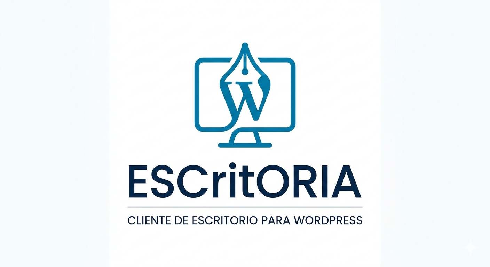

# ESCritORIA — WordPress Desktop Editor

<p align="center">
  
</p>

Cliente de escritorio multiplataforma para gestionar sitios WordPress de forma remota a través de la API REST. Construido con **Python 3** y **PyQt5**.

---

## Características


### Gestión de contenido
- **Posts**: Crear, editar, publicar, programar y eliminar entradas.
- **Páginas**: Crear, editar, publicar y eliminar páginas con soporte de jerarquía.
- **Categorías y Etiquetas**: Crear, editar y eliminar taxonomías.
- **Biblioteca de Medios**: Subir, visualizar y eliminar archivos multimedia.
- **Comentarios**: Moderar, aprobar, rechazar y eliminar comentarios.
- **Usuarios**: Gestionar usuarios y roles del sitio.
- **Ajustes del Sitio**: Configurar título, descripción, formato de enlaces permanentes, etc.

### Editor enriquecido
- Editor **HTML / Visual** con barra de herramientas y vista previa en tiempo real (WebEngine).
- **Corrector ortográfico** multiidioma (español, inglés) con resaltado de errores y sugerencias.
- **Contador de palabras** en tiempo real: palabras, caracteres, párrafos, tiempo de lectura estimado y puntuación de legibilidad.

### SEO
- Integración con **Yoast SEO**: edición de título SEO, meta descripción, palabra clave principal, URL canónica, Open Graph, Twitter Cards y directivas robots (noindex/nofollow).

### Conectividad y modo offline
- **Multi-servidor**: Conectarse a múltiples sitios WordPress simultáneamente.
- **Modo offline**: Detección automática de conexión, guardado local de borradores en `~/.escritoria/offline_drafts/` y sincronización automática al recuperar la conexión.
- Indicador visual de estado online/offline y borradores pendientes.

### Interfaz
- Tema oscuro inspirado en el panel de administración de WordPress.
- **UI adaptativa**: escala automáticamente fuentes, widgets y estilos según la resolución del monitor.
- Hilos de trabajo (`WorkerThread`) para operaciones de red sin bloquear la interfaz.

---

## Requisitos

| Requisito | Versión mínima |
|-----------|----------------|
| Python | 3.8+ |
| WordPress | 5.6+ (con [Application Passwords](https://make.wordpress.org/core/2020/11/05/application-passwords-integration-guide/) habilitados) |
| Conexión | HTTPS recomendada |

### Dependencias de Python

| Paquete | Uso |
|---------|-----|
| `PyQt5` | Interfaz gráfica |
| `PyQtWebEngine` | Vista previa del editor |
| `requests` | Comunicación con la API REST |
| `python-dateutil` | Manejo de fechas |
| `keyring` | Almacenamiento seguro de credenciales |
| `Pillow` | Procesamiento de imágenes |
| `bleach` | Sanitización de HTML |
| `markdown` | Conversión Markdown → HTML |
| `pyspellchecker` | Corrector ortográfico |

> Las dependencias se instalan automáticamente al ejecutar `run_app.py`.

---

## Instalación y ejecución

```bash
# Clonar el repositorio
git clone <URL_DEL_REPOSITORIO>
cd EDITOR-WORDPRESS

# Ejecutar (crea el entorno virtual e instala dependencias automáticamente)
python3 run_app.py
```

El lanzador `run_app.py` se encarga de:
1. Crear un entorno virtual en `.venv/` si no existe.
2. Instalar o actualizar las dependencias de `requirements.txt`.
3. Iniciar la aplicación principal (`main.py`).

Si prefieres gestionar el entorno manualmente:

```bash
python3 -m venv .venv
source .venv/bin/activate        # Linux/macOS
# .venv\Scripts\activate         # Windows
pip install -r requirements.txt
python3 main.py
```

---

## Configuración del servidor WordPress

1. En WordPress, ve a **Usuarios → Tu Perfil**.
2. Desplázate hasta **Contraseñas de Aplicación**.
3. Introduce un nombre para la aplicación (ej: *"ESCritORIA"*).
4. Haz clic en **Añadir nueva contraseña de aplicación**.
5. Copia la contraseña generada.
6. En ESCritORIA, ve a **Conexión → Nueva Conexión**.
7. Introduce la URL del sitio, usuario y la contraseña de aplicación.

Las credenciales se almacenan de forma segura a través del sistema de keyring del SO.

---

## Estructura del proyecto

```
EDITOR-WORDPRESS/
├── run_app.py                   # Lanzador (venv + dependencias + arranque)
├── main.py                      # Punto de entrada de la aplicación
├── requirements.txt             # Dependencias de Python
├── img/
│   └── logo.png                 # Logotipo de la aplicación
├── config/
│   ├── __init__.py
│   └── settings.py              # Configuración, constantes y persistencia JSON
├── api/
│   ├── __init__.py
│   ├── client.py                # Cliente base API REST de WordPress
│   ├── posts.py                 # API de Posts
│   ├── pages.py                 # API de Páginas
│   ├── categories.py            # API de Categorías
│   ├── tags.py                  # API de Etiquetas
│   ├── media.py                 # API de Medios
│   ├── comments.py              # API de Comentarios
│   ├── users.py                 # API de Usuarios
│   ├── settings_api.py          # API de Ajustes del sitio
│   └── yoast_seo.py             # Integración con Yoast SEO
├── gui/
│   ├── __init__.py
│   ├── main_window.py           # Ventana principal con barra lateral
│   ├── connection_dialog.py     # Diálogo de conexión al servidor
│   ├── editor_widget.py         # Editor de contenido (HTML/Visual/Preview)
│   ├── posts_widget.py          # Widget de Posts
│   ├── pages_widget.py          # Widget de Páginas
│   ├── categories_widget.py     # Widget de Categorías
│   ├── tags_widget.py           # Widget de Etiquetas
│   ├── media_widget.py          # Widget de Medios
│   ├── comments_widget.py       # Widget de Comentarios
│   ├── users_widget.py          # Widget de Usuarios
│   ├── settings_widget.py       # Widget de Ajustes
│   └── styles.py                # Tema oscuro adaptativo (CSS Qt)
└── utils/
    ├── __init__.py
    ├── helpers.py               # Utilidades comunes
    ├── worker.py                # WorkerThread genérico (QThread)
    ├── screen_utils.py          # Escalado de UI según resolución
    ├── spell_checker.py         # Corrector ortográfico con resaltado
    ├── word_counter.py          # Estadísticas de texto en tiempo real
    └── offline_manager.py       # Modo offline y sincronización de borradores
```

---

## Configuración de la aplicación

Las preferencias se guardan en `~/.escritoria/config.json` e incluyen:

- Tema de interfaz
- Idioma del corrector ortográfico
- Tamaño de fuente
- Número de posts por página
- Intervalo de auto-guardado
- Geometría de la ventana

---

## Licencia

MIT
